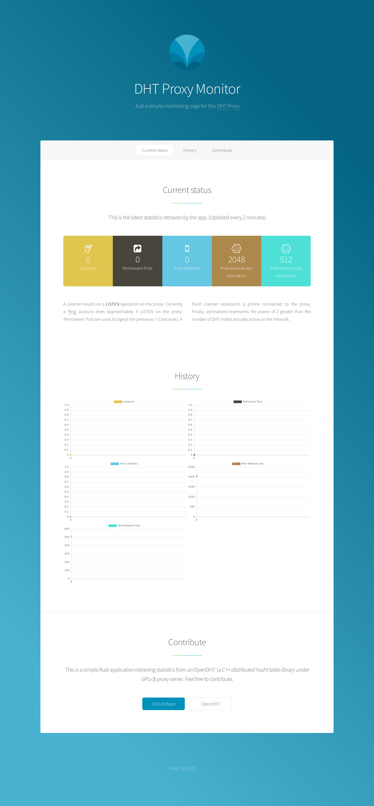

# DHT Proxy Monitor

Just a little application to see statistics from an [OpenDHT Proxy Server](https://opendht.net)

# How it works

It just perform a `STATS` request on `/`. This will return some statistics and then show it in a webpage designed by [HTML5up.net](http://html5up.net/).

# Run your instance

1. You will need `openssl` (or something to generate a certificate) and `cargo` installed (for building and running this repo).
2. Then generate a `.p12` with openssl.
3. You will need a `config.json` file:
```
{
  "proxy": "http://dhtproxy.ring.cx",
  "api_listener": "0.0.0.0:1412",
  "cert_path": "keys/api.p12",
  "cert_pass": ""
}
```
where `api_listener` is the address listened by the app and `keys/api.p12` the certificate previously generated.
4. `cargo run`
5. Go to `https://127.0.0.1:1412`




## Contribute

Please, feel free to contribute to this project in submitting patches, corrections, opening issues, etc.

This app is a quick and dirty POC but can be largely improved.

For more infos read the [Code of conduct](/CODE_OF_CONDUCT.md).
